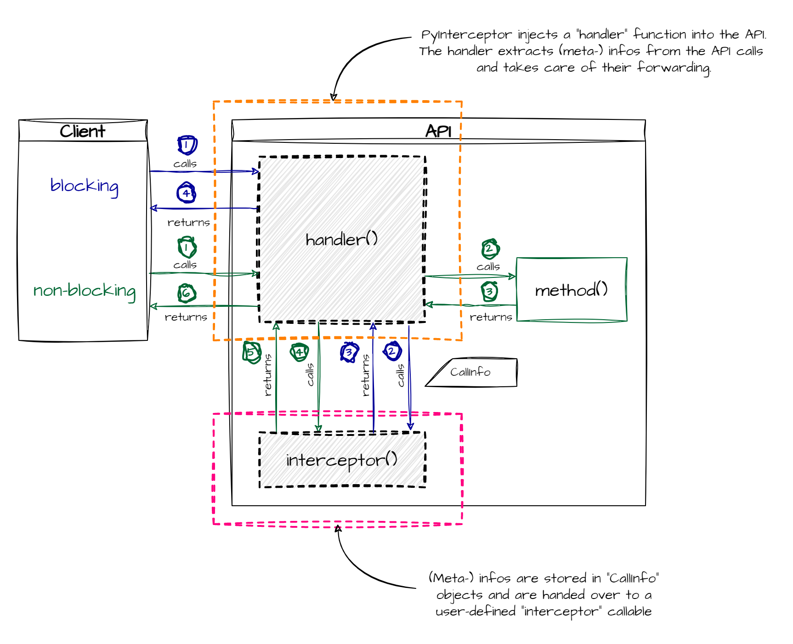

# PyInterceptor

A library for intercepting and processing Python method calls.

## Introduction

Sometimes it might be interesting to get detailed knowledge about which methods of an object have been called with which
args, kwargs, at which time, etc. but without changing the underlying code.
This is especially useful for:

- Debugging
- Logging
- Creating call statistics, etc.

PyInterceptor enables exactly this - it installs a handler function into a target object that intercepts
methods and stores (meta-) data about the calls in `CallInfo` objects. These objects are then handed over to a
user-defined `interceptor` callable.



PyInterceptor distinguishes between 2 modi:

- blocking mode: In this mode the handler does not execute the actual method and returns the return value from the
  `interceptor` callable. This mode is very useful when creating mocks or stubs.
- non-blocking mode: In this mode the handler executes the actual method and forwards its return value to the
  `interceptor` callable. Then it continues like in the blocking mode.

## Installation

To install PyInterceptor from pypi using pip type:
`pip install py-interceptor`

To install PyInterceptor from source, do the following steps:

1. Create an environment, e.g. with venv
    - `python -m venv env`
    - `env\Scripts\activate` (windows)
    - `source env/bin/activate` (linux)
2. Install the package from source
    - `pip install -e .` (without dev dependencies)
    - `pip install -e .[dev]` (with dev dependencies)
3. Execute unit tests (requires dev dependencies)
    - `pytest`

## Examples

The following example demonstrates how easy it is to intercept an object's method. Here we want to print the name of the
executed API method together with the args and the return value:

```python
from interceptor import CallInfo, intercept


class API:
    def add(self, a, b):
        return a + b

def interceptor(info: CallInfo):
    print(f"Executed {info.name} with args {info.args} -> returned {info.ret_value}")

api = API()
intercept("add", api, interceptor, blocking=False)
api.add(1, 2)
```
The output should be:
`Executed add with args (1, 2) -> returned 3`

More example can be found in the [examples](examples) folder.

## API Documentation
*To be done*

